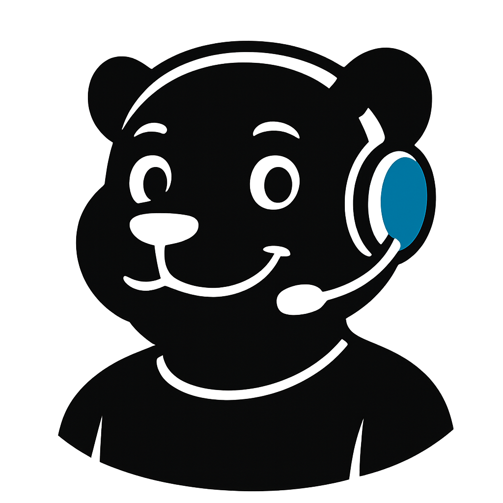
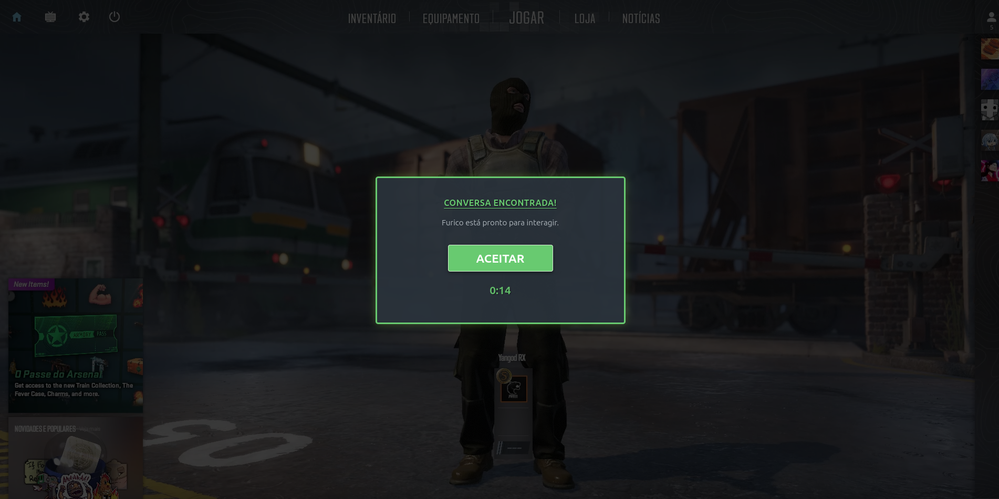
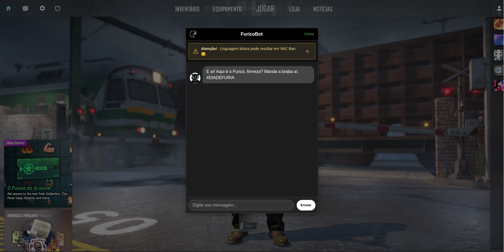

# Furico - O Chatbot da Torcida FURIA 🐾

Um chatbot feito com React e TypeScript para fãs da FURIA Esports, inspirado no mascote Furico!



## 📖 Sobre o Projeto

Bem-vindo ao Furico, o chatbot não oficial criado especialmente para a vibrante comunidade de fãs da FURIA Esports! Inspirado no mascote Furico, este projeto foi desenvolvido com o objetivo de oferecer um ponto de interação rápido e divertido para obter informações sobre o time de CS da FURIA, utilizando React, TypeScript e Vite.

A interface busca seguir a identidade visual preta e branca característica da organização e oferecer uma experiência imersiva, como a tela inicial de "aceitar partida", e som característico.

## ✨ Funcionalidades Principais

- 🎮 **Tela de Aceite Interativa:** Simula a tela de "aceitar partida" do CS:GO/CS2 com som e contador regressivo para iniciar a conversa.
- 🗨️ **Interface Conversacional:** Um chat simples e direto para interação.
- 🐾 **Personalidade Furico:** Respostas e saudações com o nome e o espírito do mascote.
- ⚫⚪ **Tema FURIA:** Design inspirado nas cores e na identidade da organização.
- ℹ️ **Informações Rápidas:**
  - Saudações e despedidas no estilo FURIA! (`#DIADEFURIA`)
  - Informações sobre a line-up atual de CS.
  - **Dados (Semi)-Estáticos sobre Jogos e Classificação:**
    - Respostas sobre o último jogo e próximo jogo agendado (_Baseado em dados inseridos manualmente no código_).
    - Apresentação da classificação de um torneio recente específico (_Baseado em dados inseridos manualmente no código_).
    - **Nota:** Essas informações não são atualizadas em tempo real e requerem atualização manual no arquivo `src/services/botService.ts` para se manterem relevantes.
  - Links para acompanhar campeonatos e agenda completa na HLTV.
  - Links diretos para a loja oficial da FURIA (`furia.gg`).
  - Links para as redes sociais da organização (Twitter, Instagram).
- 🤔 **Respostas Inteligentes (Básicas):** Reconhecimento de palavras-chave simples (ignorando acentos e maiúsculas/minúsculas) para direcionar a conversa.
- ❓ **Fallback Amigável:** Respostas aleatórias e simpáticas para comandos não reconhecidos.
- ⚠️ **Aviso "VAC Ban":** Um aviso divertido (que pode ser fechado) sobre manter a linguagem respeitosa no chat.

## ⚠️ Limitações Atuais

- **Dados Estáticos:** Conforme mencionado, informações como resultados de jogos específicos, próximas partidas agendadas e classificações detalhadas de torneios **não são buscadas em tempo real** de fontes externas (como APIs). Elas são definidas diretamente no código (`src/services/botService.ts`) e precisam ser atualizadas manualmente pelo desenvolvedor para refletir o estado mais recente. O bot direciona para a HLTV para dados sempre atualizados.
- **NLP Simples:** O reconhecimento de intenções é baseado em palavras-chave simples (`includes()`) e não utiliza processamento de linguagem natural (NLP) avançado.

## 🚀 Tecnologias Utilizadas

- **Frontend:** [React](https://reactjs.org/) com [TypeScript](https://www.typescriptlang.org/)
- **Build Tool:** [Vite](https://vitejs.dev/)
- **Estilização:** CSS Modules
- **Ícones:** React Icons
- **Ambiente:** Node.js
- **Gerenciador de Pacotes:** npm

## 📸 Screenshots

Abaixo estão algumas imagens da aplicação em ação:

<div style="display: flex; gap: 10px; flex-wrap: wrap;">
  
  
</div>

> 📌 _As imagens acima ilustram a tela inicial e a interface conversacional do Furico._

---

## 🔧 Instalação e Configuração

Para rodar este projeto localmente, siga os passos abaixo:

1.  **Clone o repositório:**

    ```bash
    git clone https://github.com/yanocosta02/furia-chatbot-react.git
    ```

2.  **Navegue até o diretório do projeto:**

    ```bash
    cd furia-chatbot-react
    ```

3.  **Instale as dependências:**
    ```bash
    npm install
    ```

## ▶️ Rodando o Projeto

Após a instalação, você pode iniciar o servidor de desenvolvimento:

```bash
npm run dev
```

---

### 🙋‍♂️ Autor

Desenvolvido com 💻 e paixão pelo universo dos esports por [**Yan Oliveira da Costa**](https://github.com/yanocosta02).
