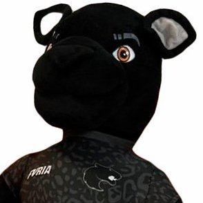

# Furico - O Chatbot da Torcida FURIA 🐾

Um chatbot feito com React e TypeScript para fãs da FURIA Esports, inspirado no mascote Furico!


_(Adicione aqui um screenshot ou GIF do chatbot funcionando! Você pode hospedar a imagem no próprio GitHub ou usar um serviço como Imgur)_

## 📖 Sobre o Projeto

Bem-vindo ao Furico, o chatbot não oficial criado especialmente para a vibrante comunidade de fãs da FURIA Esports! Inspirado no mascote Furico, este projeto visa oferecer um ponto de interação rápido e divertido para obter informações sobre o time de CS da FURIA, utilizando React, TypeScript e Vite.

A interface busca seguir a identidade visual preta e branca característica da organização.

## ✨ Funcionalidades Principais

- 🗨️ **Interface Conversacional:** Um chat simples e direto para interação.
- 🐾 **Personalidade Furico:** Respostas e saudações com o nome e o espírito do mascote.
- ⚫⚪ **Tema FURIA:** Design inspirado nas cores e na identidade da organização.
- ℹ️ **Informações Rápidas:**
  - Saudações e despedidas no estilo FURIA! (`#DIADEFURIA`)
  - Informações sobre a line-up atual de CS.
  - Respostas sobre o último jogo (com detalhes recentes - _requer atualização manual no código_).
  - Informações sobre o próximo jogo agendado (com detalhes recentes - _requer atualização manual no código_).
  - Links diretos para a loja oficial da FURIA (`furiastore.com`).
  - Links para as redes sociais da organização (Twitter, Instagram).
- 🤔 **Respostas Inteligentes (Básicas):** Reconhecimento de palavras-chave simples para direcionar a conversa.
- ❓ **Fallback Amigável:** Respostas aleatórias e simpáticas para comandos não reconhecidos.

**Nota:** As informações sobre o último e próximo jogo são atualmente (semi)-estáticas e precisam ser atualizadas manualmente no arquivo `src/services/botService.ts` para se manterem relevantes.

## 🚀 Tecnologias Utilizadas

- **Frontend:** [React](https://reactjs.org/) com [TypeScript](https://www.typescriptlang.org/)
- **Build Tool:** [Vite](https://vitejs.dev/)
- **Estilização:** CSS Modules
- **Ambiente:** Node.js
- **Gerenciador de Pacotes:** npm

## 🔧 Instalação e Configuração

Para rodar este projeto localmente, siga os passos abaixo:

1.  **Clone o repositório:**

    ```bash
    git clone https://github.com/yanocosta02/furia-chatbot-react.git
    ```

    _(Substitua pela URL correta do SEU repositório se for diferente)_

2.  **Navegue até o diretório do projeto:**

    ```bash
    cd furia-chatbot-react
    ```

3.  **Instale as dependências:**
    ```bash
    npm install
    ```

## ▶️ Rodando o Projeto

Após a instalação, você pode iniciar o servidor de desenvolvimento:

```bash
npm run dev
```
